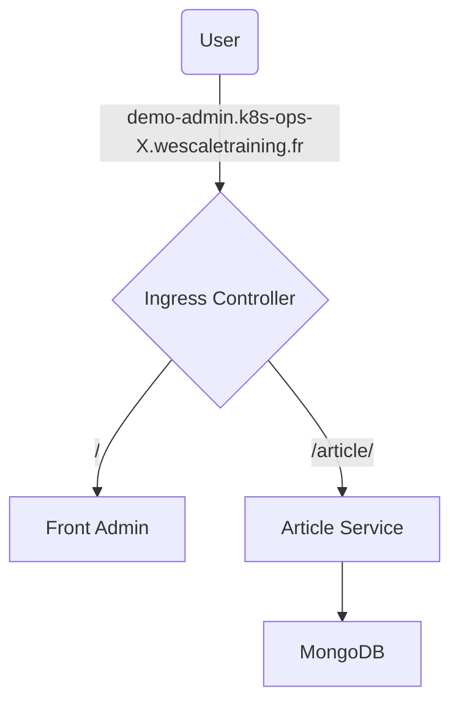

# Network policies

In this exercise, you will explore network policies to secure interactions between the different components of the stack from a network perspective.

First, you will deny all traffic coming to the application. Then you will secure each flow step by step for each component.

As a reminder here is what our deployed architecture looks like:



At the end of the exercise, you will have secured the stack: only the nginx ingress controller will receive traffic from Internet and only nginx will be allowed to connect to the demo application.

To help you during this exercise, you can refer to the [Network Policies documentation](https://kubernetes.io/docs/concepts/services-networking/network-policies/).

## Step 1 - Deny all traffic

As said above, you will start by denying all ingress traffic to the demo application.

- Create network policies to deny all ingress traffic for namespaces `ingress-nginx` and `application`.

```sh
training@bastion:~$ kubectl apply -f deny-ingress.yaml
```

- Ensure the application is not accessible from your web browser.

## Step 2 - Allow traffic to the ingress controller

You will now open ingress traffic on the `ingress controller` to allow access from the `user`.

- Create a network policy to allow ingress traffic to `TCP:80` and `TCP:443` from Internet to the `ingress-nginx-controller` pods.

```sh
# Retrieve nginx ingress controller pods labels
training@bastion:~$ kubectl get pods -n ingress-nginx -o=jsonpath='{.items[*].metadata.labels}' | jq

# Create the network policy
training@bastion:~$ kubectl apply -f allow-internet-to-ingress-controller.yaml
```

- You should get HTTP 504 (Gateway Timeout) errors in your web browser.

## Step 3 - Allow traffic to the MongoDB database

You will now open ingress traffic from the `article-service` to the `mongodb` database.

- Create a network policy to allow ingress traffic from `article-service` pods to `mongodb` pods on the configured TCP port.

```sh
# Retrieve article-service pods labels
training@bastion:~$ kubectl get pods -n application -l component=article-service -o=jsonpath='{.items[*].metadata.labels}' | jq
# Retrieve mongodb pods labels
training@bastion:~$ kubectl get pods -n application -l component=mongodb -o=jsonpath='{.items[*].metadata.labels}' | jq
# Retrieve mongodb service port
training@bastion:~$ kubectl get svc mongodb -n application

# Create the network policy
training@bastion:~$ kubectl apply -f allow-article-service-to-mongodb.yaml
```

- Make sure the `article-service` successfully connects to the database. You might have to restart the pod if it has been restarted too many times (CrashloopBackOff state).

## Step 4 - Allow traffic to the article service

From there, you will allow users to access the `article-service` through the ingress controller.

- Create a network policy to allow ingress traffic from `ingress-controller` pods to the `article-service` pods on the configured port.

```sh
# Retrieve article-service service port
training@bastion:~$ kubectl get svc article-service -n application

# Create the network policy
training@bastion:~$ kubectl apply -f allow-ingress-controller-to-article-service.yaml
```

## Step 5 - Allow traffic to the front admin UI

One last effort ! We only need to access the `front-admin` user interface now !

- You can do it on your own now, you are a network policy ninja !

```sh
# Retrieve front-admin service port
training@bastion:~$ kubectl get svc front-admin -n application

# Create the network policy
training@bastion:~$ kubectl apply -f allow-ingress-controller-to-front-admin.yaml
```

- Once done, the UI should be accessible and fully working !

**The microservices demo app is now fully secured ! Congratulations !**
