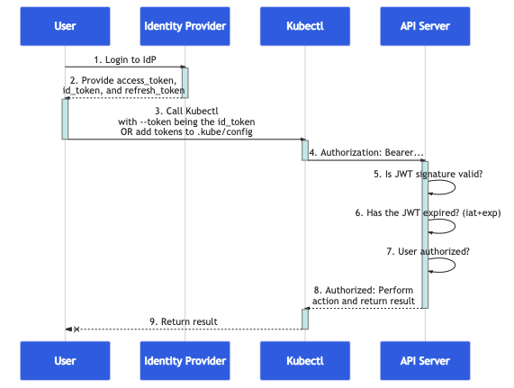

# OIDC Connect authentication with Keycloak

This demonstraton aims to configure the cluster API server to use OpenIDConnect (OIDC) tokens for user authentication.

As indicated in the following schema, Kubernetes does not perform the OIDC authentication flow of the end-user.
It just validates the given tokens and eventually refresh them if needed.



To demonstrate that, we are setting up a Keycloak instance as a docker container on the bastion instance for conveniance.
We are generating a custom certificate with certbot for SSL communication as it is needed by Kubernetes.
Once OIDC authentication configured, we create a custom user on keycloak and demonstrate how to log on the Kubernetes cluster and how RBAC is mapped.

## Install prerequisites

```bash
sudo apt-get update
sudo apt-get install -y \
    ca-certificates \
    curl \
    gnupg \
    lsb-release \
    certbot

sudo mkdir -m 0755 -p /etc/apt/keyrings
curl -fsSL https://download.docker.com/linux/ubuntu/gpg | sudo gpg --dearmor -o /etc/apt/keyrings/docker.gpg

echo \
  "deb [arch=$(dpkg --print-architecture) signed-by=/etc/apt/keyrings/docker.gpg] https://download.docker.com/linux/ubuntu \
  $(lsb_release -cs) stable" | sudo tee /etc/apt/sources.list.d/docker.list > /dev/null

sudo apt-get update

sudo apt-get install -y docker-ce docker-ce-cli containerd.io

sudo usermod -aG docker training # Relaunch the ssh session
```

## Deploy and configure Keycloak

Generate the certificate for the Keycloak instance

```bash
export BASTION_URL=bastion.k8s-ops-0.wescaletraining.fr
sudo certbot certonly --standalone --register-unsafely-without-email --preferred-challenges http -d $BASTION_URL
```

Launch a Keycloak server the generated certificate

```bash
sudo docker run -d --name keycloak -p 443:443 \
  -e KC_BOOTSTRAP_ADMIN_USERNAME=admin \
  -e KC_BOOTSTRAP_ADMIN_PASSWORD=password \
  -v /etc/letsencrypt/live/$BASTION_URL/fullchain.pem:/etc/x509/https/tls.crt \
  -v /etc/letsencrypt/live/$BASTION_URL/privkey.pem:/etc/x509/https/tls.key \
  quay.io/keycloak/keycloak:26.1 start --https-port=443 --hostname=$BASTION_URL \
  --https-certificate-file=/etc/x509/https/tls.crt \
  --https-certificate-key-file=/etc/x509/https/tls.key
```

Connect to the Keycloak admin interface in a **private navigation window**

Create a Keycloak client with the following information

- id: `kubernetes`
- protocol: `openid connect`
- client authentication: `on`
- valid redirect uris
  - `http://localhost:18000` # for kubelogin
  - `http://localhost:8000` # for kubelogin
- roles
  - create a new role `developer`
- clients scopes => kubernetes-dedicated => mapper => user client role
  - name: `groups`
  - client id: `kubernetes`
  - token claim name: `groups`

Create a test user called john

- users
  - username: `john`
    email: `john@wescaletraining.fr`
    email verified: `true`
    password: `Password1`
    role: `developer`

## Configure Kubernetes

Enable the oidc authentication plugin on the API servers. For that, add the following attributes to **ALL** the masters in the `/etc/kubernetes/manifests/kube-apiserver.yaml` file.

```yaml
containers:
- command:
    ...
    - --oidc-issuer-url=https://bastion.k8s-ops-0.wescaletraining.fr/realms/master
    - --oidc-client-id=kubernetes
    - --oidc-groups-claim=groups
    - "--oidc-groups-prefix=keycloak:"
    - --oidc-username-claim=email
```

Then wait for all API servers to restart: `crictl ps -a | grep kube-apiserver`.

Create a rolebinding for the developer Keycloak group

```sh
cat <<'EOF' | kubectl apply -f -
apiVersion: rbac.authorization.k8s.io/v1
kind: ClusterRoleBinding
metadata:
  name: developer-role-binding
subjects:
- kind: Group
  name: keycloak:developer
  apiGroup: rbac.authorization.k8s.io
roleRef:
  kind: ClusterRole
  name: view
  apiGroup: rbac.authorization.k8s.io
EOF
```

## Test connection with user john

Retrieve the cluster kubeconfig file on your laptop
```bash
scp -F provided_ssh_config bastion:/home/training/.kube/config /tmp/kubeconfig
export KUBECONFIG=/tmp/kubeconfig
```

Install kubectl plugin whoami
```bash
kubectl krew install whoami
```

Show that we are connected as admin user
```bash
kubectl whoami
kubectl get nodes
```

Install kubectl plugin kubelogin
```bash
kubectl krew install oidc-login
```

Retrieve the secret for the `kubernetes' Keycloak client on the credentials tab

Setup kubectl OIDC login
```bash
export BASTION_URL=bastion.k8s-ops-0.wescaletraining.fr
kubectl oidc-login setup \
--oidc-issuer-url=https://$BASTION_URL/realms/master \
--oidc-client-id=kubernetes \
--oidc-client-secret=<CLIENT_SECRET>s
```

Login as john@wescaletraining.fr

Add login configuration in kubeconfig file
```bash
kubectl config set-credentials oidc \
  --exec-api-version=client.authentication.k8s.io/v1beta1 \
  --exec-command=kubectl \
  --exec-arg=oidc-login \
  --exec-arg=get-token \
  --exec-arg=--oidc-issuer-url=https://$BASTION_URL/auth/realms/master \
  --exec-arg=--oidc-client-id=kubernetes \
  --exec-arg=--oidc-client-secret=<CLIENT_SECRET> \
  --exec-arg=--insecure-skip-tls-verify
```

Show that we are connected as john@wescaletraining.fr
```bash
kubectl whoami --user oidc
kubectl --user oidc get pods -A # it works
kubectl --user oidc get nodes # it does not work because we have the role viewer
```
