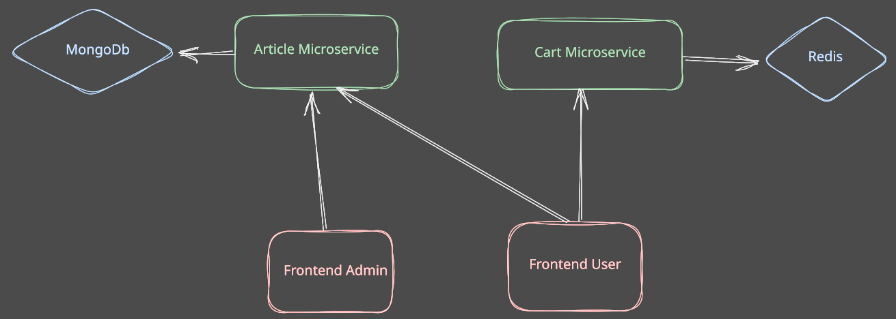

# Kubernetes Ops

This repository contains exercises used during the Kubernetes Ops training course.

## Structure

The project is composed of different directories:

* [Day-1](./Day-1/): exercises for the first day of the training course
* [Day-2](./Day-2/): exercises for the second day of the training course
* [Day-3](./Day-3/): exercises for the third day of the training course
* [resources](./resources/): resources that are useful to trainees during the exercises
* [.internal](./.internal/): solutions for all the exercises in this course

## Exercises

Each exercise has its own folder where you can find:

* A `README.md` file explaining the goals of the exercise and what features you are going to explore. Then you are given instructions of what you need to do. **/!\ Some commands, files or sentences may be wrong or need to be completed. Pay attention !**. Questions can also be asked.
* Optional additional files that are needed for the exercise.

> The instructions should be self-explanatory. In case you have questions regarding the exercise, don't hesitate to ask your trainer ! He or She is here for that !

## Microservices demo application

During this course, we will use the [microservices-demo](https://github.com/wescale/microservices-demo) stack as a sample application to showcase the different Kubernetes capabilities that we are going to talk about.

This application is composed of multiple microservices as shown below:

* `article-service`: Golang application that manages the articles.
  * Connected to a MongoDB database.
    * GET /healthz
    * GET /article/
    * POST /article/
    * DELETE /article/:articleId/
* `cart-service`: Golang application that manages the shopping cart.
  * Connected to a Redis database.
    * GET /healthz
    * GET /cart/:cartId/
    * PUT /cart/:cartId/
    * DELETE /cart/:cartId/
* `User frontend`: Vuejs application that serves as the frontend.
  * GET /
  * GET /shop
  * GET /cart
* `Admin frontend`: Vuejs application that serves as the admin
frontend.
  * GET /
  * GET /articles
  * GET /about

For more information on this project, please refer to the associated [Github repository](https://github.com/wescale/microservices-demo).
